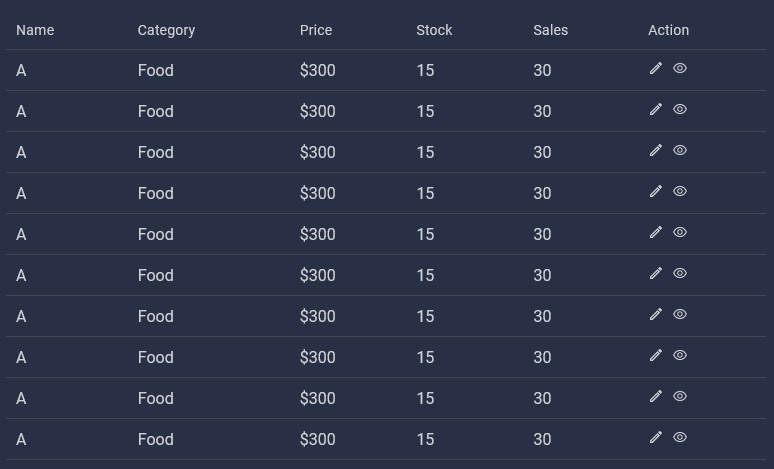
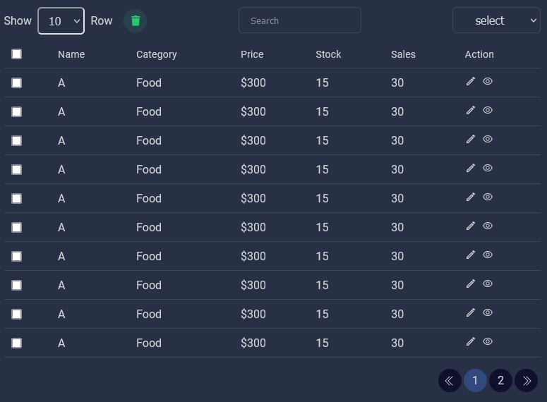

# sk-react-table

## Features

  - Search
  - Filter
  - Pagination
  - Row Selection
  - Custome Color Set
  - Responsive

# Installing

```bash
npm install sk-react-table --save
```

# Example
 
 ## Basic Table
 \


```bash
    import React from 'react'
    import ReactTable from 'sk-react-table'

    const App = () =>{

        const data =[
            {   
                id:1,
                name : 'A',
                status:'active'
            },
            .....
        ]
        const columns =[
            {
                name: 'Name',
                cell: row => <span>{row.name}</span>
            },
            {
                name: 'Status',
                cell: row => <span>{row.status}</span>
            },
            ......
        ]
        const setColor ={
            backgroundColor:'#283046',
            textColor:'#d0d2d6',
            borderColor:'#404656',
        }

        return(
            <div className='App'>
                <ReactTable
                    data={data}
                    columns={Columns}
                    setColor={setColor}
                >
            </div>
        )
    }
```

## Advance Table
\

```bash
    import React,{useState} from 'react'
    import ReactTable from 'sk-react-table'

    const App = () =>{

        const data =[
            {   
                id:1,
                name : 'A',
                status:'active'
            },
            .....
        ]
        const columns =[
            {
                name: 'Name',
                cell: (row,fun) => <span>{row.name}</span>
            },
            {
                name: 'Status',
                cell: (row,fun) => <span onClick={fun.view}>{row.status}</span>
            },
            ......
        ]
        const setColor ={
            backgroundColor:'#283046',
            textColor:'#d0d2d6',
            borderColor:'#404656',
            paginationItemColor : '#110f2e',
            paginationActiveColor:'#31497c',
        }

        const [rowParPage, setrowParPage] = useState(10);
        const [currentPage, setCurrentPage] = useState(1);
        const [selected, setSelected] = useState([]);
        const [searchValue, setSearchValue] = useState('');
        const [filterValue, setFilterValue] = useState('')

        const rowNumber = [5, 10, 15, 20];
        const selectRef = 'id'; id or ### your data object unique value key
        const filterKey = ['', 'food', 'electronix', 'technology']; 
        const paginationItemShow = 4;

        const selectedRow = (selectRowData) => {
            console.log(selectRowData)
        }

        const view = ()=>{

        }

        return(
            <div className='App'>
                <ReactTable
                    data={data}
                    columns={Columns}
                    setColor={setColor}
                    rowNumber={rowNumber}
                    setrowParPage={setrowParPage}
                    parPage={rowParPage}
                    setCurrentPage={setCurrentPage}
                    currentPage={currentPage}
                    totalItem={10}
                    selector
                    selectRef={selectRef}
                    deleteData={selectedRow}
                    setSelected={setSelected}
                    selected={selected}
                    setSearchValue={setSearchValue}
                    filterKey={filterKey}
                    filterValue={filterValue}
                    setFilterValue={setFilterValue}
                    useFunction={{ view }}
                    paginationItemShow={paginationItemShow}
                >
            </div>
        )
    }
```
### How to make this package  [visit](https://www.youtube.com/channel/UCyNNqWbAAv7hdb9aQFt4PSg)


